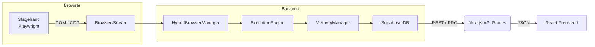

# 🧠 AEF Memory Architecture – Single Source of Truth

**Version:** 1.0 – Production
**Last updated:** <!-- YYYY-MM-DD will be inserted automatically by CI -->

---

## 1  Purpose
The AEF Memory Architecture captures **everything an execution sees, thinks and does** so that humans (and other services) can reproduce any decision with surgical precision. This document is the **canonical reference** for developers, DevOps and data scientists.

---

## 2  High-Level Overview

*   **Browser-Server** – runs inside a Docker image, exposes `/action` API (dom_snapshot, accessibility_tree, screenshot, …).
*   **HybridBrowserManager** – multiplexes browser sessions between executions.
*   **ExecutionEngine** – single place that runs every node/action.
*   **MemoryManager** – synchronous service that stores & retrieves **MemoryArtifacts**.
*   **Supabase Postgres** – persistence layer (`memory_artifacts` table + views/functions).
*   **React Front-end** – progressive-disclosure UI (NodeMemoryPanel, MemoryDetailModal).

---

## 3  Capture Lifecycle (4 Phases)

```mermaid
sequenceDiagram
    participant EE as ExecutionEngine
    participant MM as MemoryManager
    participant BSC as BrowserStateCapture
    participant BS as Browser-Server
    participant DB as Supabase

    EE->>BSC: dom_snapshot / accessibility_tree (Input)
    BSC->>BS: /action
    BS-->>BSC: HTML / Tree
    EE->>MM: captureNodeInputs()
    Note over EE,MM: **Phase 1 – Inputs captured**

    EE->>BS: perform browser / llm actions
    EE->>MM: captureNodeProcessing()
    Note over EE,MM: **Phase 2 – Processing captured**

    EE-->>MM: captureNodeOutputs()
    Note over EE,MM: **Phase 3 – Outputs captured**

    MM-->>DB: INSERT memory_artifacts
    Note over MM,DB: **Phase 4 – Context forwarding**
```


| Phase | Data Examples | Method |
|-------|---------------|--------|
| **1 Inputs** | URL, DOM snapshot, accessibility tree, credentials, variables | `captureNodeInputs` |
| **2 Processing** | LLM prompts/responses, browser events, actions, errors | `captureNodeProcessing` |
| **3 Outputs** | Extracted data, state changes, metadata, screenshots | `captureNodeOutputs` |
| **4 Forwarding** | Keys to pass onward, clearing rules, compression flags | within artifact `forwardingRules` |

All capture calls are **blocking**; the node waits until the MemoryManager ACKs persistence to guarantee determinism.

---

## 4  Data Model (TypeScript ⇄ SQL)
### 4.1 TypeScript – `lib/memory/types.ts`
Key interfaces:
* `MemoryInputs`, `MemoryProcessing`, `MemoryOutputs`, `ForwardingRules`
* `MemoryArtifact` – single row persisted per node (≈ JSONB 4-20 KB typical; DOM snapshot can be MB-scale)

### 4.2 Database – `memory_artifacts` table
```sql
CREATE TABLE memory_artifacts (
  id                UUID PRIMARY KEY,
  execution_id      TEXT,
  node_id           TEXT,
  action_index      INTEGER,
  user_id           UUID,
  timestamp         TIMESTAMPTZ DEFAULT NOW(),
  inputs            JSONB NOT NULL,
  processing        JSONB NOT NULL,
  outputs           JSONB NOT NULL,
  forwarding_rules  JSONB NOT NULL,
  created_at        TIMESTAMPTZ DEFAULT NOW(),
  updated_at        TIMESTAMPTZ DEFAULT NOW()
);
```
*   **Indexes**: composite (`execution_id, node_id, timestamp`), GIN on JSONB, full-text on `processing.errors`.
*   **Views**: `memory_flow`, `memory_debug`, `memory_execution_summary`.

---

## 5  Core Components
| Layer | File | Responsibility |
|-------|------|----------------|
| **Browser** | `app_frontend/docker/browser/browser-server.js` | Supplies DOM snapshot, accessibility tree, screenshot, etc. |
| **Session Mgr** | `lib/vnc/SingleVNCSessionManager.ts` & HybridBrowserManager | Manages Playwright sessions keyed by `executionId`. |
| **Execution** | `aef/execution_engine/engine.ts` | Runs every node; orchestrates memory capture. |
| **Memory** | `lib/memory/MemoryManager.ts` | Blocking capture, context forwarding, cache. |
| **DB Migration** | `supabase/migrations/20250128000000_create_memory_artifacts.sql` | Sets up schema, indexes, views. |
| **API** | `app/api/aef/memory/[...].ts` | CRUD + search endpoints. |
| **React UI** | `components/aef/*` | NodeMemoryPanel, MemoryPhaseView, MemoryDetailModal (with expand tree). |

---

## 6  Public APIs
### 6.1 REST (Next.js)
* `GET /api/aef/memory/:executionId` – whole execution
* `GET /api/aef/memory/:executionId/:nodeId` – single node
* `POST /api/aef/execute` – run workflow (Memory enabled)
* `POST /api/aef/action/:executionId` – run single node

### 6.2 Internal
* `MemoryManager.captureNode*` – called by ExecutionEngine
* `Browser-Server /action` – dom_snapshot, accessibility_tree, screenshot, …

---

## 7  Performance Characteristics
* **Capture latency** (inputs+processing+outputs): 5-40 ms typical, dominated by DB insert.
* **DOM snapshots**: up to 2 MB compressed; compression toggle via `MemoryCaptureConfig.compressLargeData`.
* **Supabase query**: < 100 ms for typical execution (150 artifacts, 15 MB total JSON).

---

## 8  Extensibility Guidelines
1. **New Node Types** – no code changes needed if they use ExecutionEngine; just populate `MemoryInputs/Processing/Outputs`.
2. **Large Payloads** – set `compressLargeData` or store artifact in S3 and reference URL.
3. **Conditional Forwarding** – add `conditionalForwarding` rules to limit context bloat.
4. **Schema Changes** – update `types.ts` first, then run `supabase migration`.

---

## 9  Troubleshooting Checklist
| Symptom | Likely Cause | Fix |
|---------|--------------|-----|
| Missing DOM snapshot | Browser session not found | Verify `executionId` matches running browser session. |
| No LLM interactions | Action did not call Stagehand observe | Ensure `processing.llmInteractions` is appended during node. |
| Slow queries | Uncompressed giant DOM | Enable `compressLargeData` or paginate DOM capture. |
| "Memory capture failed" error | Supabase insert error | Check `supabase logs` & table permissions. |

---

## 10  Change Log (Abbreviated)
| Date | Change | Author |
|------|--------|--------|
| 2025-01-28 | Initial production release | Team AEF |
| 2025-06-17 | Accessibility tree parity, UI expand-collapse | @o3 |
| 2025-06-17 | Consolidated doc (this file) | @o3 |

---

> **The Memory system turns debugging from guesswork into facts.** Use this document as the single source of truth when extending, debugging or operating the AEF platform. 