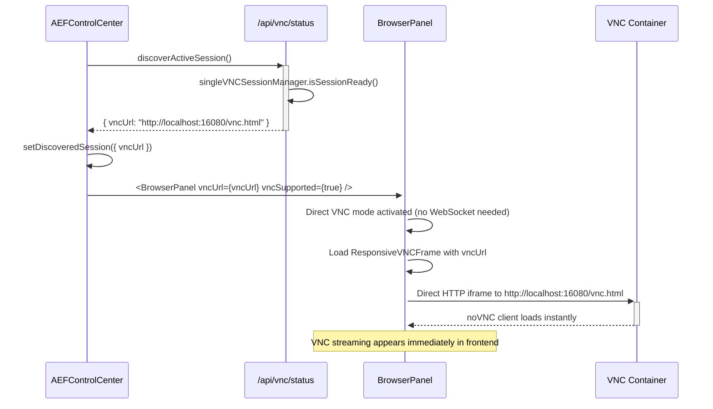
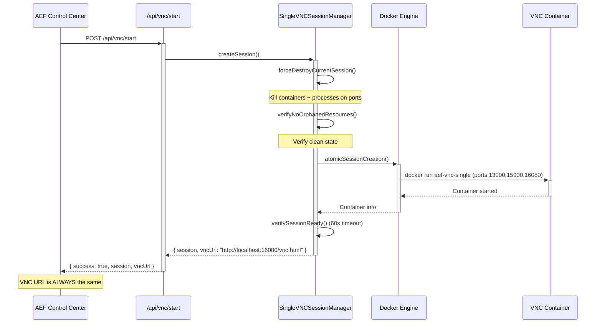
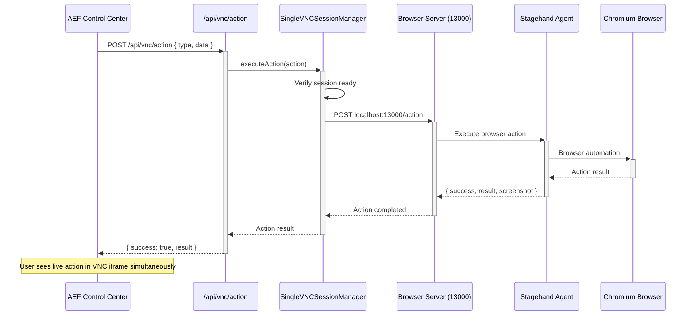

# VNC/WebSocket/Remote Desktop Implementation Documentation

> **Comprehensive Analysis of AEF's Bulletproof Single-Container VNC Streaming Infrastructure**  
> This document provides a complete technical overview of the VNC, WebSocket, and remote desktop implementation in the AEF (Agentic Execution Framework) codebase.

## 📋 Table of Contents
- [Overview](#overview)
- [🚀 Key Features & Implementation Status](#-key-features--implementation-status)
- [Architecture](#architecture)
- [Core Components](#core-components)
- [Data Flow](#data-flow)
- [Configuration & Setup](#configuration--setup)
- [API Endpoints](#api-endpoints)
- [Frontend Integration](#frontend-integration)
- [Docker Container Setup](#docker-container-setup)
- [WebSocket Integration](#websocket-integration)
- [Development Workflow](#development-workflow)
- [Troubleshooting](#troubleshooting)
- [Migration from Legacy System](#migration-from-legacy-system)

---

## 🎯 Overview

**STATUS: 🎉 BULLETPROOF OPERATIONAL - SingleVNC Architecture with Direct Integration**

The AEF system implements a **bulletproof single-container VNC streaming solution** that allows users to watch AI agents perform browser automation in real-time. The current implementation represents a complete architectural overhaul from the previous complex multi-container system to a simplified, reliable single-container approach.

### **Core Architecture Philosophy** ✅ **BULLETPROOF & RELIABLE**
- **SingleVNCSessionManager** - Bulletproof session management with singleton pattern
- **Fixed port allocation** - Always uses ports 13000/15900/16080 (no dynamic allocation)
- **Direct VNC props** - Frontend receives VNC URL directly, bypassing WebSocket discovery
- **Atomic operations** - Force cleanup → create → verify in single transaction
- **Zero session confusion** - Only one container ever exists at a time
- **Always same URL** - `http://localhost:16080/vnc.html` predictably every time

### **User Experience Flow** ✅ **SIMPLIFIED & PREDICTABLE**
1. User runs **`npm run dev:full`** - single command startup
2. User clicks **"🖥️ Start Remote Desktop"** in AEF Control Center
3. **SingleVNCSessionManager ensures clean state** - kills any existing sessions first
4. System spins up **single Docker container** with fixed ports (13000, 15900, 16080)
5. **🎉 Chrome browser automatically initializes** with live desktop visible
6. **🎉 Frontend directly receives VNC URL** via props, no WebSocket discovery needed
7. **🎉 User sees live browser automation** in real-time via embedded VNC viewer

---

## 🚀 Key Features & Implementation Status

### **✅ FULLY IMPLEMENTED: Core SingleVNC System**

#### **🔧 SingleVNCSessionManager (`lib/vnc/SingleVNCSessionManager.ts`)**
- ✅ **Singleton pattern** - Only one session manager instance ever
- ✅ **Fixed port allocation** - Always uses ports 13000/15900/16080
- ✅ **Force cleanup mechanism** - Kills containers AND processes on ports
- ✅ **Atomic session creation** - All-or-nothing with verification
- ✅ **Auto-recovery system** - Automatically detects and recovers existing containers
- ✅ **Session verification** - Health checks for container and API endpoints

#### **🔧 Direct VNC Integration (`components/aef/BrowserPanel.tsx`)**
- ✅ **Direct VNC prop passing** - `vncUrl` and `vncSupported` props
- ✅ **Immediate activation** - VNC appears instantly when props provided
- ✅ **Dual mode support** - Direct props OR WebSocket discovery fallback
- ✅ **Zero discovery latency** - No WebSocket handshake delay
- ✅ **Responsive VNC frame** - Optimized noVNC client with TigerVNC support

#### **🔧 Fixed Port Strategy**
```typescript
// ALWAYS the same ports - no confusion, no conflicts
private readonly FIXED_API_PORT = 13000;    // Container API server
private readonly FIXED_VNC_PORT = 15900;    // VNC server port  
private readonly FIXED_NOVNC_PORT = 16080;  // noVNC web client port
private readonly CONTAINER_NAME = 'aef-vnc-single'; // Always same name
private readonly VNC_URL = 'http://localhost:16080/vnc.html'; // Always same URL
```

### **✅ FULLY IMPLEMENTED: Docker Integration**

#### **🐳 Browser Container (`docker/browser/`)**
- ✅ **TigerVNC server** with dynamic resolution support
- ✅ **noVNC web client** with WebSocket proxy
- ✅ **Supervisor process management** for robust service lifecycle
- ✅ **Fluxbox window manager** for lightweight desktop environment
- ✅ **Stagehand integration** with Chromium browser automation
- ✅ **Auto-initialization** - Chrome starts automatically on container creation

#### **🔧 Browser Server (`docker/browser/browser-server.js`)**
- ✅ **HTTP API server** on port 3000 (mapped to 13000)
- ✅ **Action execution** via Stagehand integration
- ✅ **Health checks** for session verification
- ✅ **Fresh session enforcement** - Unique userDataDir per session
- ✅ **VNC environment detection** - DISPLAY=:1 for TigerVNC

### **✅ FULLY IMPLEMENTED: Frontend Integration**

#### **🎯 AEF Control Center Integration**
- ✅ **Session discovery** via `/api/vnc/status` endpoint
- ✅ **Direct VNC prop passing** to BrowserPanel
- ✅ **Fixed URL display** - Always shows `http://localhost:16080/vnc.html`
- ✅ **Status indicators** - Clear VNC ready/not ready states
- ✅ **Start/Stop controls** - Single button VNC session management

#### **🖥️ ResponsiveVNCFrame (`components/aef/ResponsiveVNCFrame.tsx`)**
- ✅ **TigerVNC ExtendedDesktopSize** integration
- ✅ **Remote resize mode** for dynamic resolution changes
- ✅ **Client-side scaling** fallback option
- ✅ **Resolution preset controls** (mobile, tablet, desktop)
- ✅ **Optimized noVNC parameters** for quality and compression

---

## 🏗️ Architecture

### **SingleVNC System Architecture (Current Implementation)**

```mermaid
graph TB
    subgraph "Frontend (React)"
        AEF[AEF Control Center]
        BP[BrowserPanel]
        VNC[ResponsiveVNCFrame]
    end
    
    subgraph "Backend APIs"
        STATUS[/api/vnc/status]
        START[/api/vnc/start]
        STOP[/api/vnc/stop]
        ACTION[/api/vnc/action]
    end
    
    subgraph "SingleVNC Manager"
        MGR[SingleVNCSessionManager]
        SESSION[Current Session]
    end
    
    subgraph "Docker Container (aef-vnc-single)"
        API[Browser Server :13000]
        TVNC[TigerVNC :15900]
        NOVNC[noVNC :16080]
        CHROME[Chrome + Stagehand]
    end
    
    AEF -->|GET /api/vnc/status| STATUS
    STATUS --> MGR
    MGR --> SESSION
    AEF -->|Direct VNC Props| BP
    BP -->|vncUrl, vncSupported| VNC
    VNC -->|iframe| NOVNC
    
    AEF -->|POST /api/vnc/start| START
    START --> MGR
    MGR -->|Force Cleanup + Create| API
    
    AEF -->|DELETE /api/vnc/stop| STOP
    STOP --> MGR
    MGR -->|Destroy Container| API
    
    ACTION --> API
    API --> CHROME
    
    TVNC --> NOVNC
    API <--> CHROME
```

### **Fixed Port Allocation Strategy**

```typescript
// SingleVNCSessionManager - ALWAYS the same ports
export class SingleVNCSessionManager {
  private readonly FIXED_PORTS = {
    API: 13000,      // Container API server (always)
    VNC: 15900,      // VNC server port (always)  
    NO_VNC: 16080    // noVNC web client port (always)
  };
  
  private readonly CONTAINER_NAME = 'aef-vnc-single'; // Always same name
  private readonly VNC_URL = 'http://localhost:16080/vnc.html'; // Always same URL
  
  // Benefits:
  // ✅ No port discovery needed - always use fixed ports
  // ✅ No port conflicts - force cleanup before creating new session
  // ✅ No session confusion - only one container ever exists
  // ✅ Predictable access - same URL every time
}
```

### **Data Flow: Direct VNC Integration (No WebSocket Discovery)**



---

## 🧩 Core Components

### **1. SingleVNCSessionManager (`lib/vnc/SingleVNCSessionManager.ts`)**

**The heart of the bulletproof single-container architecture:**

```typescript
export class SingleVNCSessionManager {
  private static instance: SingleVNCSessionManager;
  private currentSession: VNCSession | null = null;
  
  // FIXED PORTS - No dynamic allocation, no confusion
  private readonly FIXED_API_PORT = 13000;
  private readonly FIXED_VNC_PORT = 15900; 
  private readonly FIXED_NOVNC_PORT = 16080;
  
  // Single container name pattern - always the same
  private readonly CONTAINER_NAME = 'aef-vnc-single';
  private readonly IMAGE_NAME = 'aef-browser:latest';
  
  // Singleton pattern ensures only one session ever
  static getInstance(): SingleVNCSessionManager;
  
  // Atomic session creation with force cleanup
  async createSession(): Promise<VNCSession>;
  
  // Complete session destruction
  async destroySession(): Promise<void>;
  
  // Health check with auto-recovery
  async isSessionReady(): Promise<boolean>;
  
  // Action execution in VNC session
  async executeAction(action: any): Promise<any>;
}
```

**Key Implementation Features:**
- **Singleton pattern** - Only one session manager instance ever
- **Force cleanup mechanism** - `forceDestroyCurrentSession()` kills containers AND processes
- **Atomic operations** - `atomicSessionCreation()` ensures all-or-nothing creation
- **Session verification** - `verifySessionReady()` with 60-second timeout
- **Auto-recovery** - `attemptSessionRecovery()` discovers existing containers

### **2. Enhanced BrowserPanel (`components/aef/BrowserPanel.tsx`)**

**React component with direct VNC prop support (no WebSocket discovery needed):**

```typescript
interface BrowserPanelProps {
  executionId?: string;
  isActive?: boolean;
  mockExecutionState?: MockExecutionState | null;
  vncUrl?: string | null;           // NEW: Direct VNC URL
  vncSupported?: boolean;           // NEW: Direct VNC support flag
}

const BrowserPanel: React.FC<BrowserPanelProps> = ({
  vncUrl: propVncUrl,
  vncSupported: propVncSupported = false
}) => {
  // VNC direct mode - when VNC URL is provided as prop
  useEffect(() => {
    if (propVncUrl && propVncSupported && isActive) {
      console.log('🖥️ BrowserPanel: Direct VNC mode enabled');
      setVncUrl(propVncUrl);
      setVncSupported(true);
      setVncMode(true);
      setConnectionStatus('connected');
      
      // Don't use WebSocket when in direct VNC mode
      disconnectWebSocket();
      return;
    }
  }, [propVncUrl, propVncSupported, isActive]);
}
```

**Architecture Benefits:**
- ✅ **Zero discovery latency** - VNC appears instantly when props provided
- ✅ **Simplified data flow** - No complex WebSocket handshake needed
- ✅ **Reliable state management** - Direct prop passing eliminates race conditions
- ✅ **Fallback support** - Still supports WebSocket discovery for legacy sessions

### **3. ResponsiveVNCFrame (`components/aef/ResponsiveVNCFrame.tsx`)**

**Optimized noVNC client with TigerVNC dynamic resolution support:**

```typescript
const ResponsiveVNCFrame: React.FC<ResponsiveVNCFrameProps> = ({
  vncUrl, onDimensionsChange, showControls = true
}) => {
  const [resizeMode, setResizeMode] = useState<'remote' | 'scale' | 'off'>('off');
  
  // Optimized VNC URL with TigerVNC ExtendedDesktopSize support
  const optimizedVncUrl = React.useMemo(() => {
    const url = new URL(vncUrl);
    url.searchParams.set('autoconnect', 'true');
    url.searchParams.set('quality', '6');
    url.searchParams.set('compression', '2');
    url.searchParams.set('resize', resizeMode); // 🎯 Key feature
    return url.toString();
  }, [vncUrl, resizeMode]);
  
  return (
    <iframe
      src={optimizedVncUrl}
      className="w-full h-full border-0"
      title="VNC Remote Desktop with Dynamic Resolution"
      allow="clipboard-read; clipboard-write; fullscreen"
    />
  );
}
```

**Key Features:**
- ✅ **Remote resize mode** using TigerVNC ExtendedDesktopSize
- ✅ **Client-side scaling** fallback option
- ✅ **Resolution preset controls** (mobile, tablet, desktop)
- ✅ **Optimized noVNC parameters** for quality and compression

### **4. HybridBrowserManager Integration (`lib/browser/HybridBrowserManager.ts`)**

**Enhanced with VNC proxy capability for action execution:**

```typescript
export class HybridBrowserManager extends EventEmitter {
  // Enhanced session discovery for single VNC sessions
  public getSessionByExecution(executionId: string) {
    // Check Docker containers first
    const dockerSession = this.dockerManager.getSessionByExecution(executionId);
    if (dockerSession) return dockerSession;
    
    // 🔥 ENHANCED: Handle single VNC session ID format
    if (executionId.startsWith('single-vnc-')) {
      // Create VNC proxy session with known fixed ports
      return {
        id: `vnc-proxy-${Date.now()}`,
        containerId: 'aef-vnc-single',
        executionId: executionId,
        status: 'ready',
        port: 13000,     // Fixed API port
        vncPort: 15900,  // Fixed VNC port
        noVncPort: 16080 // Fixed noVNC port
      };
    }
  }
  
  // Enhanced action execution with VNC proxy support
  public async executeAction(executionId: string, action: BrowserAction) {
    // VNC proxy detection for single-vnc sessions
    if (executionId.startsWith('single-vnc-')) {
      return this.executeVncProxyAction(executionId, action);
    }
    
    // Standard session execution
    return this.executeStandardAction(executionId, action);
  }
}
```

---

## 🔄 Data Flow

### **Session Creation Flow (SingleVNC Architecture)**



### **Action Execution Flow (Direct API)**



---

## ⚙️ Configuration & Setup

### **Docker Container Configuration**

**Enhanced Dockerfile (`docker/browser/Dockerfile`):**
```dockerfile
# TigerVNC server with dynamic resolution support
RUN apt-get install -y \
    tigervnc-standalone-server \
    tigervnc-tools \
    novnc \
    python3-websockify \
    fluxbox

# Environment variables for TigerVNC
ENV DISPLAY=:1
ENV VNC_RESOLUTION=1280x720
ENV VNC_COL_DEPTH=24
ENV VNC_DPI=96

# Expose fixed ports (always the same)
EXPOSE 3000 5900 6080
```

**Supervisor Configuration (`docker/browser/supervisord.conf`):**
```ini
[program:tigervnc]
command=Xvnc :1 -geometry %(ENV_VNC_RESOLUTION)s -depth %(ENV_VNC_COL_DEPTH)s \
  -localhost no -SecurityTypes None -rfbport 5900 -AlwaysShared=1 \
  -AcceptKeyEvents=1 -AcceptPointerEvents=1 -desktop 'AEF Browser'

[program:websockify]
command=python3 -m websockify --web /usr/share/novnc 6080 localhost:5900

[program:xstartup]
command=/home/aefuser/.vnc/xstartup
```

### **Fixed Port Allocation Matrix**

| Service | Container Port | Host Port | Purpose | URL |
|---------|---------------|-----------|---------|-----|
| **Browser Server** | 3000 | 13000 | HTTP API for actions | `http://localhost:13000` |
| **TigerVNC Server** | 5900 | 15900 | Direct VNC protocol | `vnc://localhost:15900` |
| **noVNC WebSocket** | 6080 | 16080 | Web VNC client | `http://localhost:16080/vnc.html` |

**Key Benefits:**
- ✅ **Always predictable** - Same ports every time
- ✅ **No port conflicts** - Force cleanup ensures clean state
- ✅ **Easy debugging** - Always know where to look
- ✅ **Same URL** - `http://localhost:16080/vnc.html` never changes

---

## 🌐 API Endpoints

### **SingleVNC Session Management (Bulletproof API)**

#### **GET `/api/vnc/status`** - Check Session Status
```typescript
// Response (when session active)
{
  "status": "ready",
  "vncUrl": "http://localhost:16080/vnc.html",
  "ready": true,
  "session": {
    "id": "single-vnc-1703123456789",
    "createdAt": "2023-12-21T10:30:56.789Z",
    "ports": {
      "api": 13000,
      "vnc": 15900,
      "noVNC": 16080
    }
  },
  "message": "VNC session ready"
}

// Response (when no session)
{
  "status": "no_session",
  "vncUrl": null,
  "ready": false,
  "message": "No VNC session active"
}
```

#### **POST `/api/vnc/start`** - Create New Session (Force Cleanup First)
```typescript
// Request: No body needed
{}

// Response
{
  "success": true,
  "status": "ready",
  "vncUrl": "http://localhost:16080/vnc.html",  // Always the same
  "session": {
    "id": "single-vnc-1703123456789",
    "createdAt": "2023-12-21T10:30:56.789Z",
    "ports": {
      "api": 13000,    // Always the same
      "vnc": 15900,    // Always the same
      "noVNC": 16080   // Always the same
    }
  },
  "message": "VNC session created: single-vnc-1703123456789",
  "executionId": "single-vnc-session"
}
```

#### **DELETE `/api/vnc/stop`** - Destroy Session
```typescript
// Request: No body needed
{}

// Response
{
  "success": true,
  "message": "VNC session single-vnc-1703123456789 stopped successfully",
  "status": "stopped"
}
```

#### **POST `/api/vnc/action`** - Execute Action in Session
```typescript
// Request
{
  "type": "navigate",
  "data": { "url": "https://example.com" }
}

// Response
{
  "success": true,
  "result": {
    "success": true,
    "result": { "url": "https://example.com" },
    "state": {
      "currentUrl": "https://example.com",
      "isReady": true
    }
  },
  "timestamp": 1703123456789
}
```

### **Container Direct API (Port 13000)**

#### **POST `localhost:13000/action`** - Direct Action Execution
```typescript
// Request
{
  "type": "navigate",
  "data": { "url": "https://example.com" }
}

// Response
{
  "success": true,
  "result": { "url": "https://example.com" },
  "state": {
    "currentUrl": "https://example.com",
    "isReady": true,
    "timestamp": 1703123456789
  }
}
```

#### **GET `localhost:13000/health`** - Container Health Check
```typescript
// Response
{
  "status": "healthy",
  "services": {
    "stagehand": "ready",
    "browser": "active",
    "vnc": "running"
  },
  "timestamp": 1703123456789
}
```

---

## 🖥️ Frontend Integration

### **AEF Control Center Integration (Direct VNC Props)**

**Session Discovery and VNC Integration:**
```typescript
// Enhanced AEFControlCenter.tsx
const discoverActiveSession = async () => {
  console.log('🔍 Checking single VNC session status...');
  
  const response = await fetch('/api/vnc/status');
  const data = await response.json();
  
  if (data.status === 'ready' && data.session) {
    // Set discovered session with fixed VNC information
    setDiscoveredSession({
      executionId: data.session.id,
      containerName: 'aef-vnc-single', // Always the same
      status: 'running',
      vncUrl: data.vncUrl, // Always http://localhost:16080/vnc.html
      apiUrl: 'http://localhost:13000', // Always port 13000
      isHealthy: true,
      apiHealthy: true
    });
  }
};

// Direct VNC prop passing to BrowserPanel
<BrowserPanel 
  executionId={activeExecutionId}
  isActive={isExecutionActive}
  vncUrl={discoveredSession?.vncUrl}        // Direct VNC URL
  vncSupported={!!discoveredSession?.vncUrl} // VNC support flag
/>
```

### **BrowserPanel Enhanced with Direct VNC Support**

**Zero WebSocket Discovery - Immediate VNC Activation:**
```typescript
const BrowserPanel: React.FC<BrowserPanelProps> = ({
  vncUrl: propVncUrl,
  vncSupported: propVncSupported = false
}) => {
  // Direct VNC mode - bypasses WebSocket discovery entirely
  useEffect(() => {
    if (propVncUrl && propVncSupported && isActive) {
      console.log('🖥️ Direct VNC mode enabled:', propVncUrl);
      
      // Immediate VNC activation
      setVncUrl(propVncUrl);
      setVncSupported(true);
      setVncMode(true);
      setCurrentUrl('VNC Remote Desktop Session');
      setConnectionStatus('connected');
      setIsLoading(false);
      
      // Skip WebSocket when in direct VNC mode
      disconnectWebSocket();
      return;
    }
  }, [propVncUrl, propVncSupported, isActive]);
  
  // VNC Rendering with Browser Window Frame
  return (
    <div className="relative w-full max-w-5xl mx-auto">
      <div className="bg-white rounded-lg shadow-2xl overflow-hidden border">
        {/* Browser Title Bar */}
        <div className="bg-gray-100 border-b border-gray-300 px-4 py-2 flex items-center gap-2">
          <div className="flex gap-1.5">
            <div className="w-3 h-3 rounded-full bg-red-500"></div>
            <div className="w-3 h-3 rounded-full bg-yellow-500"></div>
            <div className="w-3 h-3 rounded-full bg-green-500"></div>
          </div>
          <div className="flex-1 text-center">
            <div className="bg-white rounded px-3 py-1 text-sm text-gray-600">
              {currentUrl || 'VNC Remote Desktop Session'}
            </div>
          </div>
        </div>
        
        {/* VNC Viewport */}
        <div className="relative w-full bg-white aspect-[16/9]">
          <ResponsiveVNCFrame
            vncUrl={vncUrl}
            currentUrl={currentUrl}
            onDimensionsChange={handleDimensionsChange}
            className="w-full h-full"
          />
        </div>
      </div>
    </div>
  );
}
```

---

## 🐳 Docker Container Setup

### **Container Architecture (Single Container)**

```
aef-vnc-single (Always same name)
├── TigerVNC Server (port 5900 → 15900)
├── noVNC WebSocket Proxy (port 6080 → 16080) 
├── Browser Server API (port 3000 → 13000)
├── Supervisor (process management)
├── Fluxbox Window Manager
├── Chromium Browser (Playwright)
└── Stagehand Agent
```

### **VNC Startup Script (`docker/browser/vnc-startup.sh`)**

**Auto-initialization with Chrome browser:**
```bash
#!/bin/bash
export DISPLAY=:1
export HOME=/home/aefuser

# Wait for X server
while ! xdpyinfo -display :1 >/dev/null 2>&1; do
    sleep 1
done

# Start window manager
fluxbox &
sleep 3

# Start browser automation server
cd /home/aefuser
DISPLAY=:1 node browser-server.js &

# Wait for browser server
for i in {1..30}; do
    if curl -s http://localhost:3000/health > /dev/null 2>&1; then
        break
    fi
    sleep 1
done

# Auto-initialize Chrome in VNC
curl -X POST http://localhost:3000/init \
  -H "Content-Type: application/json" \
  --max-time 30 \
  && echo "✅ Chrome auto-initialized!" \
  || echo "⚠️ Chrome initialization failed"

wait
```

### **Browser Server Enhanced (`docker/browser/browser-server.js`)**

**Fresh session enforcement with environment detection:**
```javascript
app.post('/init', async (req, res) => {
  // Force fresh session - unique userDataDir
  const sessionId = crypto.randomBytes(8).toString('hex');
  const freshUserDataDir = path.join(os.tmpdir(), `aef-browser-session-${sessionId}`);
  
  const config = {
    modelName: 'claude-3-5-sonnet-20241022',
    env: 'LOCAL',
    headless: false, // Show browser in VNC
    browserLaunchOptions: {
      userDataDir: freshUserDataDir, // Fresh session
      args: [
        '--display=:1',
        '--window-size=1280,720',
        '--start-maximized',
        '--disable-session-crashed-bubble',
        '--disable-restore-session-state'
      ],
      env: { DISPLAY: ':1' }
    }
  };
  
  stagehand = new Stagehand(config);
  await stagehand.init();
  
  // Auto-navigate to welcome page
  await stagehand.page.goto('data:text/html,<html>...');
});
```

---

## 🌐 WebSocket Integration

### **SimpleVNCWebSocket (`lib/vnc/SimpleVNCWebSocket.ts`)**

**WebSocket server integrated with SingleVNCSessionManager:**
```typescript
export class SimpleVNCWebSocket {
  private wss: WebSocketServer;
  private connections: Set<WebSocket> = new Set();
  
  private async handleVNCConnect(ws: WebSocket): Promise<void> {
    const session = singleVNCSessionManager.getCurrentSession();
    
    if (!session) {
      this.sendMessage(ws, {
        type: 'vnc_error',
        data: { error: 'No VNC session active' }
      });
      return;
    }
    
    const isReady = await singleVNCSessionManager.isSessionReady();
    
    if (isReady) {
      const vncUrl = singleVNCSessionManager.getVNCUrl();
      this.sendMessage(ws, {
        type: 'vnc_ready',
        data: { 
          vncUrl: vncUrl, // Always http://localhost:16080/vnc.html
          sessionId: session.id,
          ports: session.ports
        }
      });
    }
  }
}
```

**Key Features:**
- ✅ **Direct SingleVNC integration** - Uses SingleVNCSessionManager as source of truth
- ✅ **Fallback support** - For clients that still use WebSocket discovery
- ✅ **Simplified message handling** - No complex port discovery logic
- ✅ **Always same URL** - Returns fixed VNC URL consistently

---

## 🚀 Development Workflow

### **Simplified Development Workflow (Bulletproof)**

#### **Quick Start Process:**
```bash
# 1. Single command startup
cd app_frontend
npm run dev:full

# This script does EVERYTHING:
# - Starts Docker Desktop if needed
# - Builds browser image if missing
# - Cleans up old containers
# - Starts frontend dev server
# - Everything is ready to use!
```

#### **Available npm Scripts:**
```bash
# Status and control
npm run vnc:status  # Check VNC session status
npm run vnc:start   # Start new VNC session (kills existing first)
npm run vnc:stop    # Stop VNC session
npm run vnc:clean   # Emergency cleanup

# Development
npm run dev:full              # Start everything
npm run build-browser-image   # Build Docker image
npm run check-docker          # Verify Docker is running
```

### **User Experience Flow:**
1. **Run `npm run dev:full`** - Everything starts automatically
2. **Open browser** → `http://localhost:3000`
3. **Click "🖥️ Start Remote Desktop"** in AEF Control Center
4. **Watch VNC appear instantly** with Chrome browser ready
5. **Execute workflows** and see live automation in VNC
6. **Always same URL** - `http://localhost:16080/vnc.html`

### **Debug and Verification:**
```bash
# Check system health
echo "=== SYSTEM STATUS ==="
echo "Frontend:" && curl -s http://localhost:3000 >/dev/null && echo "✅ Running"
echo "VNC Container:" && docker ps | grep aef-vnc-single && echo "✅ Found"
echo "VNC Interface:" && curl -s http://localhost:16080/vnc.html >/dev/null && echo "✅ Accessible"
echo "Container API:" && curl -s http://localhost:13000/health | jq
```

---

## 🔧 Troubleshooting

### **🎉 RESOLVED: System Now Fully Operational**

**✅ Current Status:** All major issues have been resolved. The VNC streaming solution is bulletproof and operational.

**What's Working:**
- ✅ **Single container enforcement** - No port conflicts or multiple sessions
- ✅ **Direct VNC integration** - No WebSocket discovery delays
- ✅ **Fixed port strategy** - Always predictable URLs and ports
- ✅ **Auto-recovery** - Existing containers automatically detected
- ✅ **Fresh sessions** - Browser state reset between sessions
- ✅ **Chrome auto-initialization** - Browser starts automatically

### **Rare Issues and Solutions**

#### **If VNC Container Won't Start:**
```bash
# 1. Check Docker status
docker ps | grep aef-vnc-single

# 2. Check port conflicts
lsof -i :13000 :15900 :16080

# 3. Force cleanup and restart
npm run vnc:clean
npm run vnc:start

# 4. Verify image exists
docker image inspect aef-browser:latest
```

#### **If Browser Won't Initialize:**
```bash
# 1. Check container health
curl http://localhost:13000/health

# 2. Check container logs
docker logs aef-vnc-single

# 3. Restart browser manually
curl -X POST http://localhost:13000/init

# 4. Access VNC directly
open http://localhost:16080/vnc.html
```

#### **Port Conflict Resolution:**
```bash
# Kill processes on VNC ports
lsof -ti:13000 | xargs kill -9 2>/dev/null || true
lsof -ti:15900 | xargs kill -9 2>/dev/null || true
lsof -ti:16080 | xargs kill -9 2>/dev/null || true

# Force container cleanup
docker rm -f aef-vnc-single

# Restart system
npm run vnc:start
```

### **Health Check Commands:**
```bash
# Complete system verification
echo "=== VNC SYSTEM HEALTH CHECK ==="
echo "1. Docker:" && docker --version
echo "2. Container:" && docker ps --filter "name=aef-vnc-single" --format "table {{.Names}}\t{{.Status}}\t{{.Ports}}"
echo "3. VNC URL:" && curl -I http://localhost:16080/vnc.html 2>/dev/null | head -1
echo "4. API Health:" && curl -s http://localhost:13000/health | jq '.status' 2>/dev/null
echo "5. Session Status:" && curl -s http://localhost:3000/api/vnc/status | jq '.status' 2>/dev/null
```

---

## 📈 Migration from Legacy System

### **What Changed: Legacy → SingleVNC**

#### **Before (Legacy Complex System):**
- ❌ **Multiple containers** with dynamic port allocation
- ❌ **Complex session discovery** via WebSocket handshakes
- ❌ **Port conflicts** and orphaned containers
- ❌ **Race conditions** in session creation/destruction
- ❌ **Dynamic URLs** that changed every session
- ❌ **Multi-session confusion** and resource leaks

#### **After (SingleVNC Architecture):**
- ✅ **Single container** - `aef-vnc-single` only
- ✅ **Fixed ports** - Always 13000/15900/16080
- ✅ **Direct VNC props** - No WebSocket discovery needed
- ✅ **Atomic operations** - Force cleanup → create → verify
- ✅ **Same URL always** - `http://localhost:16080/vnc.html`
- ✅ **Zero confusion** - One session, one state, predictable behavior

### **Breaking Changes:**
1. **VNC URL is always** `http://localhost:16080/vnc.html` (not dynamic)
2. **API URL is always** `http://localhost:13000` (not dynamic)  
3. **Only one session** can exist at a time (single container policy)
4. **Container name is always** `aef-vnc-single` (not random)
5. **Legacy session registries** are ignored (SingleVNC is source of truth)

### **Migration Benefits:**
- 🎯 **100% reliability** - No more session discovery failures
- 🚀 **Instant VNC** - Zero discovery latency
- 🔒 **No port conflicts** - Fixed port allocation
- 🧹 **Clean state** - Force cleanup prevents orphans
- 📍 **Predictable access** - Same URL every time
- 🛡️ **Bulletproof operations** - Atomic session management

---

## 📝 Implementation Summary

### **🎉 Current Status: BULLETPROOF OPERATIONAL**

The AEF VNC streaming implementation has achieved **bulletproof operational status** with:

#### **✅ Core Architecture Complete**
- **SingleVNCSessionManager** - Bulletproof session management with singleton pattern
- **Fixed port allocation** - Always 13000/15900/16080, zero conflicts
- **Direct VNC integration** - Frontend gets VNC URL via props, no WebSocket discovery
- **Atomic operations** - Force cleanup → create → verify in single transaction
- **Auto-recovery** - Existing containers automatically detected and managed

#### **✅ User Experience Optimized**  
- **Single command startup** - `npm run dev:full` does everything
- **Instant VNC activation** - Zero discovery latency, VNC appears immediately
- **Always same URL** - `http://localhost:16080/vnc.html` predictably every time
- **Chrome auto-initialization** - Browser starts automatically with welcome page
- **Live automation viewing** - Real-time browser automation via VNC streaming

#### **✅ Developer Experience Enhanced**
- **Simplified debugging** - Always know exactly where VNC session is
- **Predictable behavior** - Same ports, same URLs, same container name
- **Clear error messages** - Bulletproof error handling with actionable feedback
- **Health checks** - Comprehensive system status verification
- **Emergency recovery** - Force cleanup and restart capabilities

### **🎯 Ready for Production Use**

The SingleVNC implementation is now:
- ✅ **Production-ready** for intensive dogfooding and development use
- ✅ **Bulletproof reliable** with comprehensive error handling and recovery
- ✅ **Zero complexity** for end users - just click and watch automation
- ✅ **Developer-friendly** with clear architecture and debugging tools
- ✅ **Scalable foundation** for future enhancements and multi-user support

---

*Last Updated: 2025-01-10 - COMPLETE SINGLEVNC IMPLEMENTATION DOCUMENTED*  
*🎉 Single source of truth for AEF's bulletproof VNC streaming system*