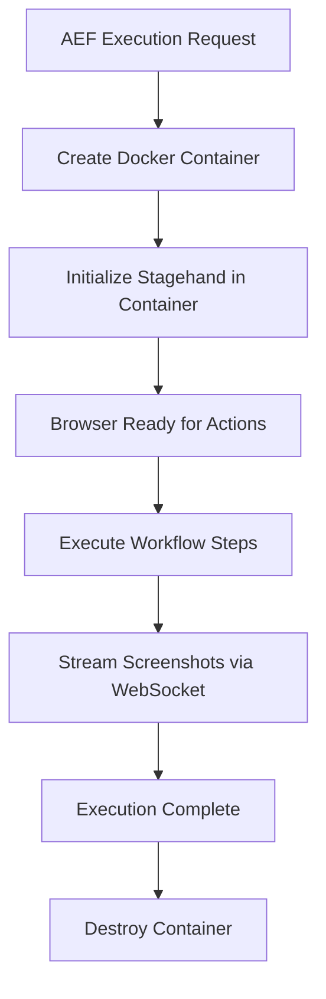

# 🐳 Docker Browser Integration - Setup Guide

## Overview

The AEF system now supports **containerized browser automation** for enhanced security and isolation. Each AEF execution runs in its own Docker container with a fresh browser environment.

## 🎯 Benefits

**Security & Isolation**:
- Each workflow gets a clean, isolated browser environment
- No access to host system data, cookies, or personal information
- Automatic cleanup after execution

**Production Ready**:
- Works on headless servers without GUI requirements
- Consistent execution environment across different systems
- Easy scaling and resource management

**Development Friendly**:
- Visual debugging still available via Xvfb
- Screenshot streaming for real-time monitoring
- Fallback to local browsers for development

## 🚀 Quick Start

### 1. Prerequisites

```bash
# Install Docker (if not already installed)
# macOS: Download Docker Desktop
# Linux: sudo apt-get install docker.io
# Windows: Download Docker Desktop

# Verify Docker is running
docker --version
docker ps
```

### 2. Build Browser Image

```bash
cd app_frontend

# Build the AEF browser Docker image
npm run build-browser-image

# Verify image was created
docker images aef-browser:latest
```

### 3. Start Development with Docker

```bash
# Start with containerized browsers (recommended)
npm run dev:docker

# Or start manually
npm run build-browser-image
npm run dev:full
```

### 4. Test Docker Integration

```bash
# Test containerized browser automation
node demo-docker-browser.js

# Test hybrid system (local + docker)
node demo-browser-automation.js
```

## 🔧 Configuration

### Browser Mode Selection

The system supports both local and containerized browsers:

```typescript
// Force Docker mode (recommended for production)
const session = await hybridBrowserManager.createSession({
  executionId: 'my-execution',
  userId: 'user-123',
  mode: 'docker' // or 'local'
});

// Set default mode globally
hybridBrowserManager.setDefaultMode('docker');
```

### Environment Variables

```bash
# Required for browser containers
OPENAI_API_KEY=your-openai-key

# Optional: Docker configuration
DOCKER_HOST=unix:///var/run/docker.sock
```

## 📊 Architecture

### Container Lifecycle



### Port Management

- **Container Ports**: 13000-13009 (10 concurrent containers max)
- **Internal Port**: 3000 (browser server inside container)
- **WebSocket**: 3003 (real-time updates)

### Resource Limits

- **Memory**: 512MB per container
- **CPU**: 512 CPU shares per container
- **Timeout**: 30 minutes idle timeout
- **Cleanup**: Automatic container removal

## 🛠️ Development

### Local vs Docker Development

```bash
# Development with local browsers (faster startup)
npm run dev

# Development with Docker containers (production-like)
npm run dev:docker
```

### Debugging Containers

```bash
# List running containers
docker ps

# View container logs
docker logs aef-browser-session_123

# Connect to container shell
docker exec -it aef-browser-session_123 /bin/bash

# View browser server logs
docker logs aef-browser-session_123 | grep "Browser Server"
```

### Manual Container Management

```bash
# Build image manually
cd docker/browser
docker build -t aef-browser:latest .

# Run container manually
docker run -p 13000:3000 \
  -e OPENAI_API_KEY=your-key \
  aef-browser:latest

# Test container health
curl http://localhost:13000/health
```

## 🔍 Monitoring

### Container Stats

```typescript
// Get manager statistics
const stats = hybridBrowserManager.getStats();
console.log(stats);

// Output:
{
  mode: 'docker',
  localSessions: 0,
  dockerContainers: 2,
  totalSessions: 2,
  wsConnections: 1,
  dockerStats: {
    activeContainers: 2,
    availablePorts: 8,
    maxContainers: 10,
    containers: [...]
  }
}
```

### Health Checks

```bash
# Check container health
curl http://localhost:13000/health

# Response:
{
  "status": "healthy",
  "initialized": true,
  "lastActivity": "2024-12-01T10:30:00Z",
  "uptime": 120.5
}
```

## 🚨 Troubleshooting

### Common Issues

**1. Docker Not Running**
```bash
# Error: Cannot connect to Docker daemon
sudo systemctl start docker  # Linux
# Or start Docker Desktop on macOS/Windows
```

**2. Image Build Fails**
```bash
# Clear Docker cache and rebuild
docker system prune -f
npm run build-browser-image
```

**3. Container Creation Fails**
```bash
# Check available ports
docker ps | grep 13000-13009

# Check Docker resources
docker system df
```

**4. Browser Not Responding**
```bash
# Check container logs
docker logs aef-browser-session_123

# Restart container
docker restart aef-browser-session_123
```

### Performance Issues

**Slow Container Startup**:
- Image is built on first use (~2-3 minutes)
- Subsequent containers start in ~10-15 seconds
- Consider pre-building image in CI/CD

**High Memory Usage**:
- Each container uses ~512MB RAM
- Limit concurrent executions if needed
- Monitor with `docker stats`

**Network Issues**:
- Ensure ports 13000-13009 are available
- Check firewall settings
- Verify Docker network configuration

## 🔄 Migration Guide

### From Local to Docker

1. **Update Configuration**:
```typescript
// Old: Local browsers only
const session = await browserManager.createSession(config);

// New: Hybrid with Docker default
const session = await hybridBrowserManager.createSession({
  ...config,
  mode: 'docker'
});
```

2. **Update Scripts**:
```bash
# Old development
npm run dev

# New development (with Docker)
npm run dev:docker
```

3. **Environment Setup**:
```bash
# Build browser image once
npm run build-browser-image

# Verify Docker integration
node demo-docker-browser.js
```

## 📈 Production Deployment

### Docker Compose (Optional)

```yaml
version: '3.8'
services:
  aef-app:
    build: .
    ports:
      - "3000:3000"
    environment:
      - OPENAI_API_KEY=${OPENAI_API_KEY}
    volumes:
      - /var/run/docker.sock:/var/run/docker.sock
    depends_on:
      - browser-image-builder

  browser-image-builder:
    build: ./docker/browser
    image: aef-browser:latest
    command: "true"  # Just build the image
```

### Scaling Considerations

- **Container Limits**: Adjust `maxContainers` in DockerBrowserManager
- **Resource Monitoring**: Use Docker metrics for scaling decisions
- **Load Balancing**: Multiple AEF instances can share Docker daemon
- **Cleanup Strategy**: Implement custom cleanup policies if needed

---

## 🎉 Success!

You now have a fully containerized browser automation system that provides:

✅ **Security**: Isolated browser environments  
✅ **Scalability**: Multiple concurrent executions  
✅ **Reliability**: Automatic cleanup and recovery  
✅ **Monitoring**: Real-time stats and health checks  
✅ **Development**: Easy local testing and debugging  

The system automatically handles container lifecycle, port management, and resource cleanup while providing the same API as the local browser system. 